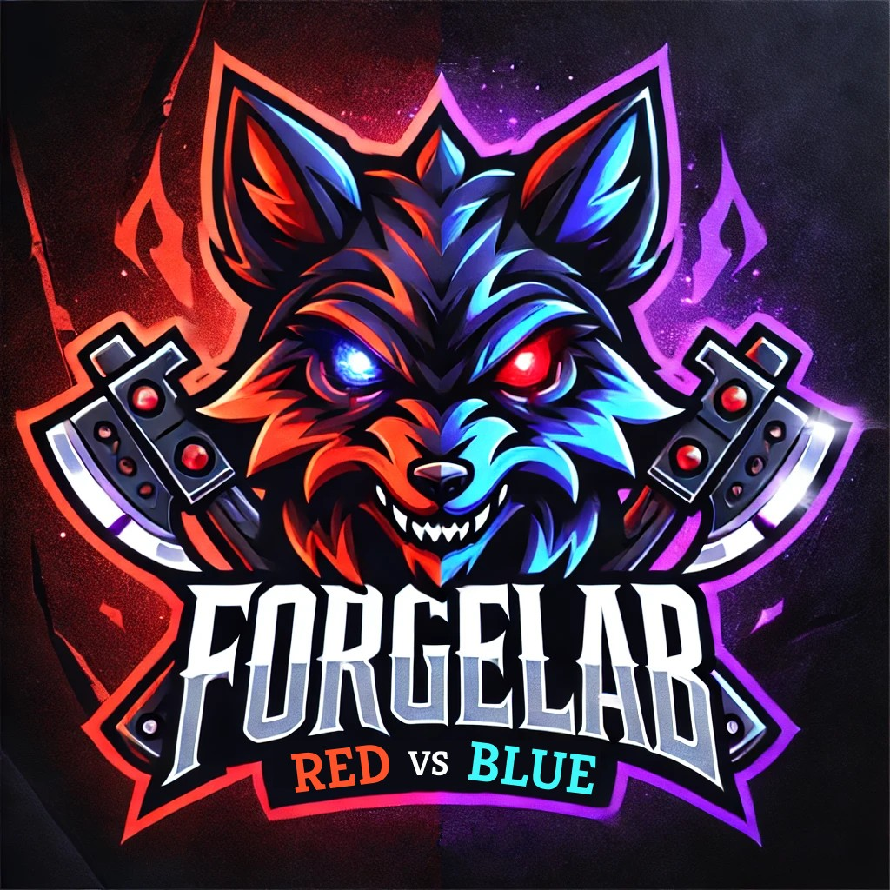

  

# Bienvenue sur ForgeLab ! 

ForgeLab est un laboratoire Purple Team où créativité et cybersécurité se rencontrent. Ici, on construit, on teste, on améliore, et parfois... on casse (volontairement ou pas) des règles de sécurité, le tout dans un environnement maîtrisé. 🚀

---

## 🎯 Objectif du Projet

- 🛡️**Tester et perfectionner des règles de détection** (notamment avec Wazuh) pour couvrir les tactiques, techniques et procédures des attaquants.
- 🔍 **Analyser les menaces** : Étudier les événements de sécurité pour améliorer nos stratégies de réponse aux incidents.
- 🚀 **Tester et contourner** : Pousser nos propres règles dans leurs retranchements pour identifier leurs limites.
- 📊 **Générer des rapports d'attaque** : Grâce à des outils comme PurpleOps.
- 🛠️ **Explorer des outils de sécurité** : Évaluer différentes solutions pour mieux comprendre le marché.

---

## 🛠️ L'Aventure  

Tout a commencé avec un vieux PC HP équipé d’un processeur i3, seulement **4 Go de RAM** et un **disque dur mécanique (HDD)**. 

> *Photo du PC d’origine*  

####  Les premières améliorations
On a décidé de lui donner une seconde vie :  
- 💾 **Ajout de RAM** : 2 x 8 Go pour booster les performances.  
- ⚡ **SSD flambant neuf** : 500 To.  

La RAM pour améliorer la capacité multitâche et réduire les ralentissements, et le SSD pour accélérer les temps de chargement et rendre le système beaucoup plus réactif.

---

### 🧑‍💻 Installation du serveur
- **OS choisi** : Ubuntu 24.04 LTS Server. Pourquoi ? Parce que c'est stable, fiable et parfait pour un projet comme ForgeLab.  
- **Premiers outils installés** :  
  - 📈 **Grafana** : Pour surveiller les performances du serveur.  
  - 🗂️ **Dashy** : Une vue d’ensemble claire de tout ce qui tourne sur le serveur.

---

## 🕵️‍♂️ Sécuriser le Lab : Les premières étapes

1. **[CrowdSec]()** : Une solution open-source pour protéger le serveur avec des règles adaptées.  
   - 🛡️ On a ajouté des règles pour détecter les connexions suspectes sur les **ports 22 (SSH)** et **80 (HTTP)**.  Bien entendu on a changé le port par défaut du ssh !
   - 🕵️‍♀️ Objectif : Construire une base de *threat intelligence* en identifiant les bots malveillants.

2. **[Wazuh]()** : On a vite vu plus grand avec ce SIEM/XDR :  
   - 🌐 **Gestion centralisée** : Pour superviser plusieurs équipements.  
   - 🛠️ **Règles personnalisées** : Adapter les détections à nos besoins spécifiques.

3. **[Lynis]()** : Un outil d'audit de sécurité open-source pour analyser et renforcer la configuration du système.
    - 🔍 **Audit approfondi** : Vérification des permissions, services actifs, et configurations critiques.
    - 🛠️ **Recommandations pratiques** : Suggestions d'améliorations basées sur les résultats de l'audit pour durcir la sécurité.
Grâce à Lynis, nous avons pu identifier rapidement des failles potentielles et optimiser les paramètres de sécurité pour un environnement encore plus robuste.

---

## 💡 Toujours plus grand : Une upgrade serveur !

Avec nos ambitions décuplées, le vieux PC n’était plus à la hauteur. Nous avons donc investi dans un **serveur plus puissant**.  

> *Photo du nouveau serveur*  

### 📦 Ce qu’on a installé dessus :
- **Proxmox** : Pour segmenter nos usages et faciliter le monitoring.  
- **Wazuh** : Toujours le cœur de notre sécurité.  
- **Bitwarden** : Gestionnaire de mots de passe pour sécuriser nos accès.  
- **PurpleOps**: Pour les rapports

> Vous pouvez visité **[Homelab](https://github.com/Purpelab/ForgeLab/tree/main/Homelab)** Pour en savoir plus sur tous les outils installé ! 

---

## 🌱 Pourquoi cette aventure est enrichissante

- 💡 **Apprentissage constant** : Découvrir et tester de nouvelles technologies de sécurité.  
- 🤝 **Travail collaboratif** : Développer un esprit Purple Team (Red + Blue).  
- 🛠️ **Montée en compétences techniques** : Que ce soit en SIEM, honeypots, infrastructur, réseau, Blue Team et Red Team.  

---

## 🚀 Et après ?

L’aventure ne fait que commencer ! On envisage d’ajouter encore plus de fonctionnalités, d’intégrer des outils innovants et de partager nos découvertes avec la communauté. Restez connectés pour suivre nos progrès. 

---

Merci de suivre **ForgeLab**, et n’hésitez pas à nous laisser un ⭐ sur GitHub si ce projet vous inspire ! 🙌
